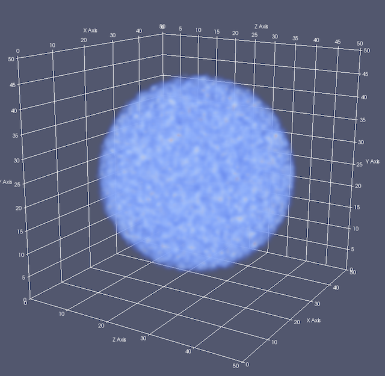

# 並列MDで複数プロセスにまたがる粒子データから密度プロファイルを作成するサンプル

## 概要

並列MDで領域分割を採用している際に、各プロセスが持つ粒子データから密度プロファイルを作成して最終的にParaViewで可視化するサンプル。

このコードの解説を[Qiita](https://qiita.com/kaityo256/items/59a12abc48883bfefd62)に書きました。

## 使い方

    $ make
    $ make test

MPIのヘッダやライブラリへのパスが通っている必要があります。また、OpenMPIを前提にしているため、MPICHなどでは実行などに修正が必要かもしれません。

## 結果

作成された `test.vtk`や`test_mpi.vtk`をParaViewの「Volume」でレンダリングするとこんな感じになります。

